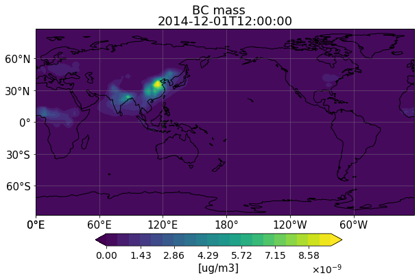
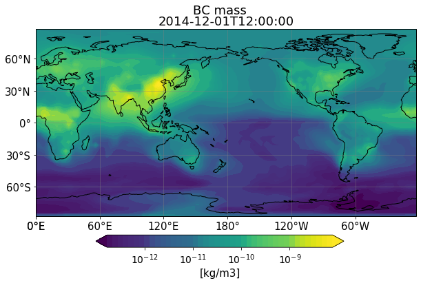
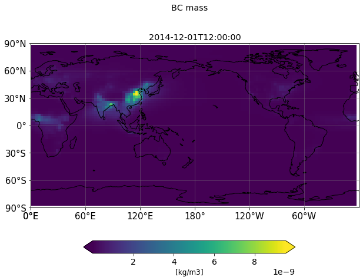
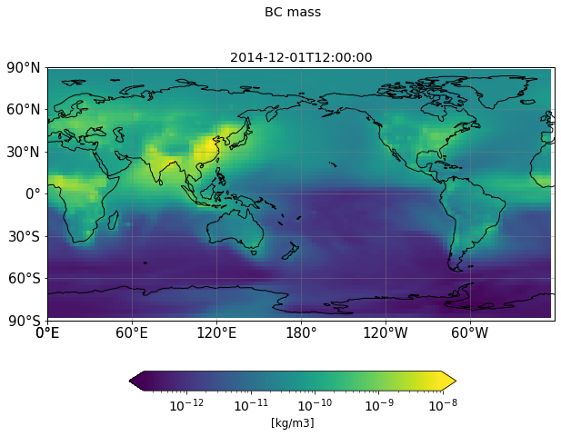
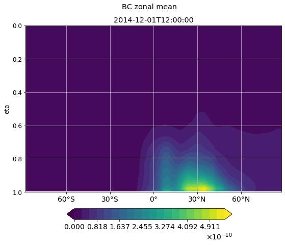
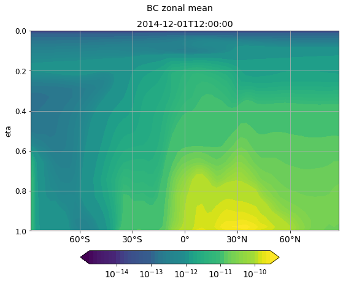

# pygtool3

## Overview(概要)

大気循環モデルAGCM5(CCSR/NIES)のI/Oルーチンで利用されているgtool3形式のデータを解析するライブラリです。

## Description(詳細)

gtool3形式のデータは以下の構造をとっている。

```fortran
<4byte> !FORTRAN header
<16 characters X 64 lines>　!data discription
<4byte>!FORTRAN fooder
<4byte>
<4byte array> !model raw data
<4byte>
```

基本的にはこれをnumpyで読み取ることでpythonから、データの解析、プロットを可能にしています。`pygtool3`では、これをさらに発展させ、ヘッダー情報を含めた独自のクラス定義に基づくインスタンスをして値を返却します。これによってより柔軟な解析を簡潔なコードで実現しています。

## Demo

```python
grid=pygtool.readgrid()
xx,yy=grid.getmesh()
t=pygtool.read3d('./sampledata/T.clim',count=4)
pygtool.gtplot.contourf(xx,yy,bc.getarr()[0,:,:])
```


## Requirement

python >=3.6

numpy

pandas

matplotlib

cartopy

xarray

numba

## Usage(使用方法)


### import

モジュールとして用いる場合は`sys`でモジュールサーチパスを追加してからimportしてください。(こっちの方が安全かもです)

```python
import sys
sys.path.append('pygtool3')
import pygtool
```

### reading model data

gtool3形式はFORTRANバイナリを直接ファイルに書き込んでいるようなものなので、netcdf4やHDF5のようにself-describedなデータ形式ではありません。そのため読み込みの際には、モデルの出力の次元(2D or 3D)、それぞれの軸の格子の数、データの総数を知っておく必要があります。誤った値を設定すると、格納するデータが意味不明な値になります。


#### read 2D data(2次元)

```python
surface_pressure=pygtool.read2d('./sampledata/ps',count=4)
```

第１引数はファイルパス、`count`:データの総数

x,yで格子数を指定。デフォルトで(x,y)=(128,64)

#### read 3D data(3次元)

```python
temperature=pygtool.read3d('./sampledata/t',count=4)
bc=pygtool.read3d('./sampledata/mc_bc',count=4)
```

2次元のときと同様。格子はx,y,zで指定する。デフォルトで(x,y,z)=(128,64,36)

#### reading grid data(格子情報の読み込み)

格子情報のデータを読み取り、緯度(lat)、経度(lon)、標準化高度(sigma)をそれぞれ`numpy.ndarray`として変数に代入します。

```python
# horizontal
geogrid=pygtool.readgrid()# defaultの格子情報を使う場合
#t85を用いる場合
#geogrid=pygtool.readgrid(x=256,y=128
#			,lonfile='GTAXLOC.GLON256'
#           ,latfile='GTAXLOC.GGLA128')
lon,lat=geogrid.getlonlat()
xx,yy=geogrid.getmesh()
area=geogrid.getarea()
```

`lon`,`lat`はそれぞれ(128,),(64,)の1次元配列

`xx`,`yy`は`lon`,`lat`を2次元配列に拡張したもので、プロットの際に必要です

`area`は格子の面積を表す2次元配列で、領域平均を計算したりする場合に使います。

defaultの解像度は`t42`となっています。もし変更する場合は`readgrid()`にx,y,lonfile,latfileを設定してください。

```python
# vertical
sigma=pygtool.readsigma() #default
#sigma=pygtool.readsigma(z=57,
#      gtaxfile='GTAXLOC.CETA57')
```

デフォルトでは`gtaxfile=GTAXLOC.HETA36,z=36`となっています。

### calculation(簡単な計算処理)

#### calculate pressure(気圧の計算)

地表面気圧から3次元の気圧配列を取得する。

```python
P=sigma.get_pressure(ps,cyclic=False,timestep=0)
```

##### get column conc. from mass conc.(質量濃度からカラム量を計算)

質量濃度(cmass)からカラム量を求めるためには気温(t),地表面気圧(ps)および、グリッドの中心、境界の格子情報インスタンスが必要になります。これらを`pygtool.gtcalic.getmass_column()`に渡すとことで、カラム量を得ることができます。引数`fact`は単位調整用のファクターで初期値は1.0となっています。

```python
columnBC=pygtool.gtcalic.getcmass_column(cmass=bc,sigma=sigma,sigma_M=sigma_M,T=t,ps=ps,fact=1e6)
```


### plotting(プロット)

全球及び、経度断面図のみコンター図及びメッシュ図のインターフェイスを導入している。

#### global contour(全球コンター図)

##### pygtool.gtplot.contourf

```python
fig,ax,cbar=pygtool.gtplot.contourf(xx,yy,bc.getarr()[0,:,:])
cbar.set_label('[ug/m3]')
ax.set_title(bc.getdate())
fig.suptitle('BC mass')
```



##### pygtool.gtplot.logcontourf

```python
fig,ax,cbar=pygtool.gtplot.logcontourf(xx,yy,bc.getarr()[0,:,:],subs='all')
cbar.set_label('[kg/m3]')
ax.set_title(bc.getdate())
fig.suptitle('BC mass')
```



##### pygtool.gtplot.pcolormesh

```python
fig,ax,cbar=pygtool.gtplot.pcolormesh(xx,yy,bc)
cbar.set_label('[kg/m3]')
ax.set_title(bc.getdate())
fig.suptitle('BC mass')
```



```python
fig,ax,cbar=pygtool.gtplot.pcolormesh(xx,yy,bc,scale='log')
cbar.set_label('[kg/m3]')
ax.set_title(bc.getdate())
fig.suptitle('BC mass')
```


#### zonal mean(経度断面)

デフォルトで東西平均断面をプロットします。

プロットの前には断面に使う格子情報を作成します。

```python
yy,zz=np.meshgrid(lat,sigma.ss)
```

##### pygtool.gtplot.zonal_contour

```python
fig,ax,cbar=pygtool.gtplot.zonal_contourf(yy,zz,bc,dlat=30)
fig.suptitle('BC zonal mean')
ax.set_title(bc.getdate())
```



##### pygtool.gtplot.zonal_logcontourf

```python
fig,ax,cbar=pygtool.gtplot.zonal_logcontourf(yy,zz,bc,dlat=30)
fig.suptitle('BC zonal mean')
ax.set_title(bc.getdate())
```



##### pygtool.gtplot.zonal_pcolormesh

```python
fig,ax,cbar=pygtool.gtplot.zonal_pcolormesh(yy,zz,bc,dlat=30)
fig.suptitle('BC zonal mean')
ax.set_title(bc.getdate())
```


```python
fig,ax,cbar=pygtool.gtplot.zonal_pcolormesh(yy,zz,bc,dlat=30,scale='log')
fig.suptitle('BC zonal mean')
ax.set_title(bc.getdate())
```


σ座標以外の座標系だと事前に座標変換の処理が必要になってきます。

細かいオプションについてはドキュメント(作成予定)かdocstringを参照してください。

## Install


## Contribution

## License
[MIT](https://github.com/earth06/pygtool3/blob/master/info/LICENCE.md)

## Author
[earth06](https://github.com/earth06)

## Document
[作成中](https://earth06.github.io/pygtool3/)
